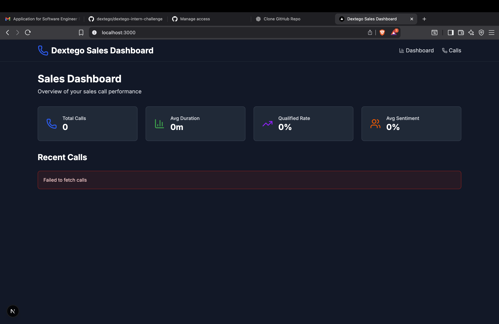

# Dextego Intern Challenge

## Fixes Implemented ✅

### 1. JSON File (calls.json)  
- Fixed invalid JSON format.  
- Added missing commas.  
- Removed trailing commas.  
- Ensured all values are valid (e.g., `"duration": 900` as a number, not a string).  

### 2. React Code (Dashboard Component)  
**Bug:**  
```jsx
<p className="text-2xl font-bold text-gray-900 dark:text-white">{totalCalls}</p>
Changed it to use
<p className="text-2xl font-bold text-gray-900 dark:text-white">{stats.totalCalls}</p>



